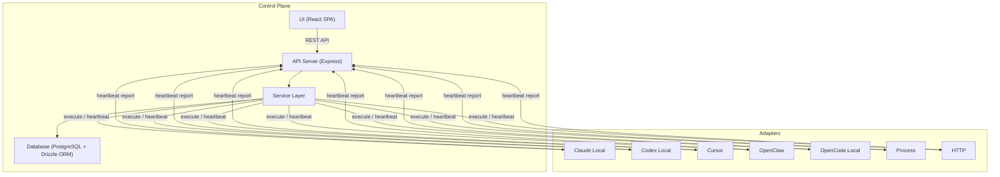
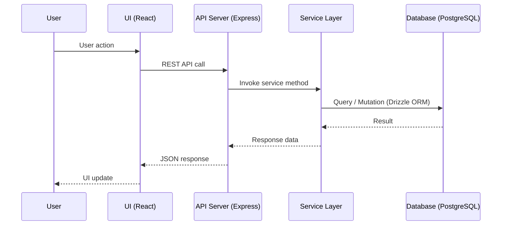
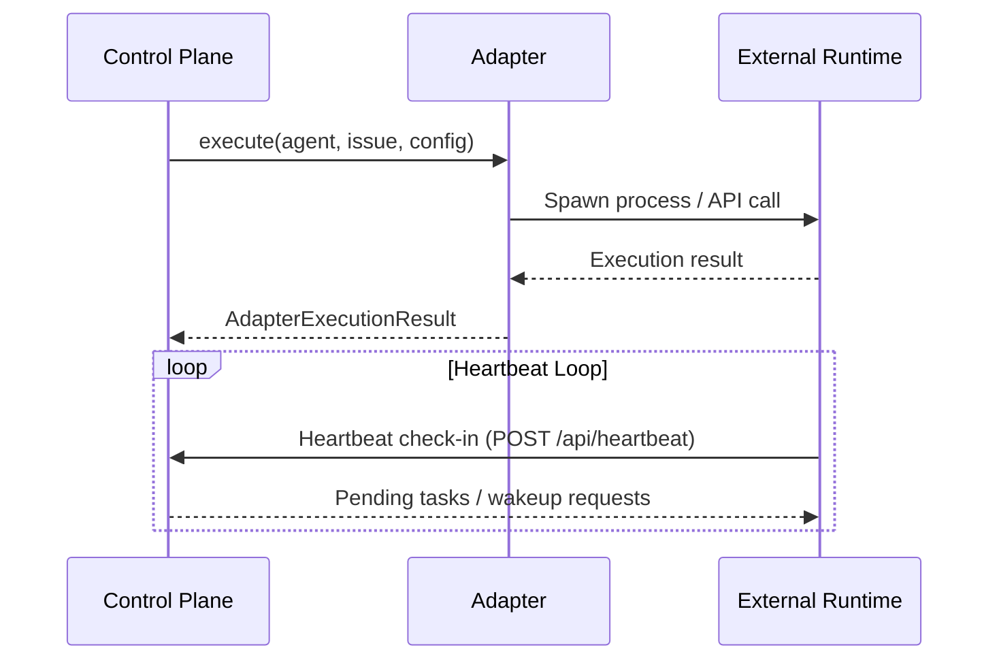
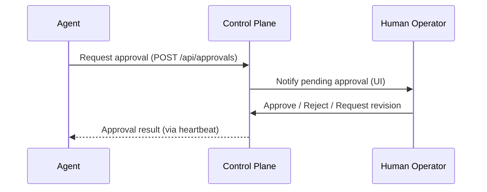

# Paperclip 핵심 기능 분석서

## 프로젝트 개요

Paperclip은 **AI 에이전트 오케스트레이션 플랫폼**이다. 자율적으로 운영되는 AI 회사(autonomous company)를 위한 제어 평면(Control Plane)을 제공하며, 에이전트 등록, 작업 관리, 비용 추적, 목표 정렬, 인간 거버넌스를 단일 인터페이스에서 수행할 수 있도록 설계되었다.

본 프로젝트를 **AI 에이전시 운영 플랫폼**으로 활용할 경우, 에이전트를 직원처럼 관리하고, 프로젝트/이슈 단위로 작업을 할당하며, 어댑터를 통해 다양한 실행 환경을 연결하는 구조가 핵심이다.

---

## 아키텍처

Paperclip은 **제어 평면(Control Plane) + 어댑터(Adapter)** 2계층 구조로 구성된다.

### 제어 평면 (Control Plane)

중앙 신경계 역할을 하며, 에이전트 레지스트리, 작업 할당/상태 관리, 비용 추적, 목표 계층(Company > Team > Agent > Task), Heartbeat 모니터링을 담당한다.

| 계층 | 기술 스택 | 주요 디렉토리 |
|------|-----------|---------------|
| UI | React + TypeScript + Vite | `ui/src/` |
| API | Express (Node.js) | `server/src/routes/` |
| Service | 비즈니스 로직 계층 | `server/src/services/` |
| DB | PostgreSQL + Drizzle ORM | `packages/db/src/` |
| CLI | 커맨드라인 도구 | `cli/src/` |

### 어댑터 (Adapter)

에이전트는 외부에서 실행되고, 어댑터를 통해 제어 평면에 보고한다. 제어 평면은 에이전트를 직접 실행하지 않고 오케스트레이션만 수행한다.

| 어댑터 | 타입 | 설명 |
|--------|------|------|
| Claude Local | `claude_local` | Anthropic Claude CLI 로컬 실행 |
| Codex Local | `codex_local` | OpenAI Codex 로컬 실행 |
| Cursor | `cursor` | Cursor IDE 연동 |
| OpenClaw | `openclaw` | OpenClaw 클라우드 런타임 |
| OpenCode Local | `opencode_local` | OpenCode 로컬 실행 |
| Process | `process` | 범용 프로세스 실행 |
| HTTP | `http` | HTTP API 호출 방식 |

---

## 6대 핵심 기능

### 1. Company (회사)

AI 회사를 생성하고 관리하는 최상위 엔티티. 조직 구조, 멤버십, 초대, 접근 권한을 포함한다.

**관련 파일:**
- 스키마: `packages/db/src/schema/companies.ts`, `company_memberships.ts`, `invites.ts`, `join_requests.ts`
- 서비스: `server/src/services/companies.ts`, `server/src/services/access.ts`
- 라우트: `server/src/routes/companies.ts`, `server/src/routes/access.ts`
- UI: `ui/src/pages/Companies.tsx`, `ui/src/pages/CompanySettings.tsx`, `ui/src/pages/Org.tsx`, `ui/src/pages/OrgChart.tsx`
- API 클라이언트: `ui/src/api/companies.ts`, `ui/src/api/access.ts`

### 2. Agent (에이전트)

AI 에이전트를 직원처럼 등록, 구성, 관리한다. 역할, 보고 체계, 어댑터 타입, 런타임 설정, 월간 예산을 포함한다. 에이전트별 API 키 발급과 설정 이력(Config Revision) 관리를 지원한다.

**관련 파일:**
- 스키마: `packages/db/src/schema/agents.ts`, `agent_api_keys.ts`, `agent_config_revisions.ts`, `agent_runtime_state.ts`, `agent_task_sessions.ts`, `agent_wakeup_requests.ts`
- 서비스: `server/src/services/agents.ts`, `server/src/services/agent-permissions.ts`
- 라우트: `server/src/routes/agents.ts`
- UI: `ui/src/pages/Agents.tsx`, `ui/src/pages/AgentDetail.tsx`, `ui/src/components/AgentProperties.tsx`
- API 클라이언트: `ui/src/api/agents.ts`

### 3. Issue (이슈)

작업 단위를 관리한다. 상태(backlog, todo, in_progress, in_review, blocked, done, cancelled), 우선순위, 라벨, 첨부파일, 댓글을 포함한다. 프로젝트 및 목표와 연결되며, 에이전트에게 할당 가능하다.

**관련 파일:**
- 스키마: `packages/db/src/schema/issues.ts`, `issue_comments.ts`, `issue_labels.ts`, `issue_attachments.ts`, `issue_read_states.ts`, `issue_approvals.ts`
- 서비스: `server/src/services/issues.ts`, `server/src/services/issue-approvals.ts`
- 라우트: `server/src/routes/issues.ts`, `server/src/routes/issues-checkout-wakeup.ts`
- UI: `ui/src/pages/Issues.tsx`, `ui/src/pages/IssueDetail.tsx`, `ui/src/pages/MyIssues.tsx`, `ui/src/components/KanbanBoard.tsx`
- API 클라이언트: `ui/src/api/issues.ts`

### 4. Heartbeat (심박)

에이전트의 생존 상태를 모니터링한다. 에이전트가 주기적으로 체크인하여 실행 중, 대기 중, 멈춤 상태를 파악한다. 실행 로그(Run Log), 비용 이벤트, 웨이크업 요청을 관리한다.

**관련 파일:**
- 스키마: `packages/db/src/schema/heartbeat_runs.ts`, `heartbeat_run_events.ts`
- 서비스: `server/src/services/heartbeat.ts`
- UI: `ui/src/pages/Activity.tsx`, `ui/src/components/ActivityCharts.tsx`, `ui/src/components/ActivityRow.tsx`
- API 클라이언트: `ui/src/api/heartbeats.ts`, `ui/src/api/activity.ts`

### 5. Adapter (어댑터)

다양한 AI 런타임 환경을 통합하는 플러그인 계층. 각 어댑터는 `execute` (실행), `testEnvironment` (환경 검증), `sessionCodec` (세션 직렬화) 인터페이스를 구현한다.

**관련 파일:**
- 서버 어댑터: `server/src/adapters/registry.ts`, `server/src/adapters/types.ts`
- UI 어댑터: `ui/src/adapters/registry.ts`, `ui/src/adapters/types.ts`
- 어댑터 패키지: `packages/adapters/claude-local/`, `codex-local/`, `cursor-local/`, `openclaw/`, `opencode-local/`
- 공통 유틸: `packages/adapter-utils/`
- 프로세스 어댑터: `server/src/adapters/process/`
- HTTP 어댑터: `server/src/adapters/http/`

### 6. Approval (승인)

에이전트의 중요한 행동에 대해 인간의 승인을 요구하는 거버넌스 메커니즘. 승인 요청 생성, 상태 관리(pending, approved, rejected, revision_requested), 댓글을 지원한다. 에이전트 고용(hire) 승인 훅도 포함한다.

**관련 파일:**
- 스키마: `packages/db/src/schema/approvals.ts`, `approval_comments.ts`
- 서비스: `server/src/services/approvals.ts`, `server/src/services/hire-hook.ts`
- 라우트: `server/src/routes/approvals.ts`
- UI: `ui/src/pages/Approvals.tsx`, `ui/src/pages/ApprovalDetail.tsx`, `ui/src/components/ApprovalCard.tsx`, `ui/src/components/ApprovalPayload.tsx`
- API 클라이언트: `ui/src/api/approvals.ts`

---

## 데이터 흐름

### 사용자 요청 흐름

### 에이전트 실행 흐름

### 승인 흐름

---

## 커스터마이징 접점 요약

| 접점 | 위치 | 설명 |
|------|------|------|
| 새 어댑터 추가 | `packages/adapters/`, `server/src/adapters/registry.ts`, `ui/src/adapters/registry.ts` | `ServerAdapterModule` / `UIAdapterModule` 인터페이스 구현 후 레지스트리에 등록 |
| DB 스키마 확장 | `packages/db/src/schema/` | Drizzle ORM 스키마 파일 추가 및 마이그레이션 |
| API 엔드포인트 추가 | `server/src/routes/` | Express 라우터 추가 후 `server/src/routes/index.ts`에 등록 |
| 서비스 로직 확장 | `server/src/services/` | 비즈니스 로직 모듈 추가 |
| UI 페이지 추가 | `ui/src/pages/`, `ui/src/lib/router.tsx` | React 컴포넌트 생성 및 라우터 등록 |
| 비용 추적 커스텀 | `packages/db/src/schema/cost_events.ts`, `server/src/services/costs.ts` | 비용 이벤트 스키마 및 집계 로직 수정 |
| 목표 계층 확장 | `server/src/services/goals.ts`, `ui/src/pages/Goals.tsx` | 목표-프로젝트-이슈 연결 구조 커스터마이징 |
| 권한/인증 확장 | `server/src/services/access.ts`, `server/src/auth/`, `server/src/middleware/` | 인증 미들웨어 및 권한 체계 수정 |
| 실시간 이벤트 | `server/src/services/live-events.ts`, `server/src/realtime/` | SSE 기반 실시간 알림 확장 |
